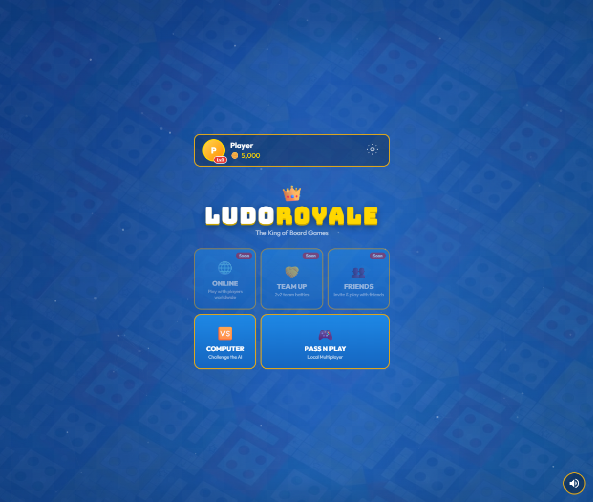
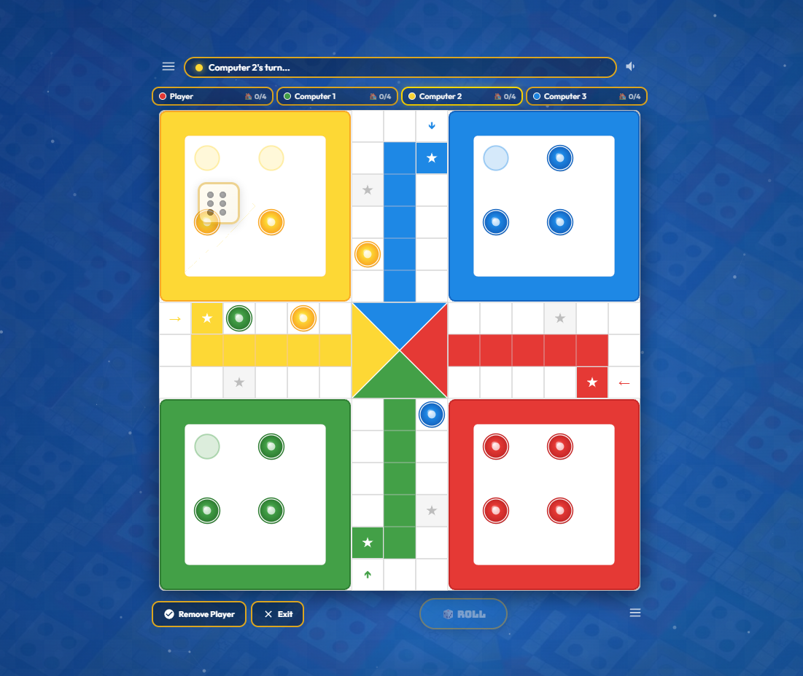
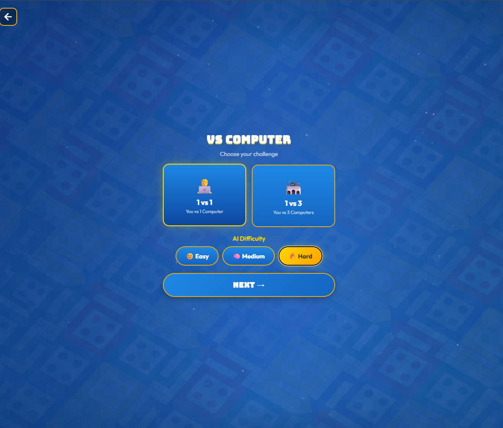
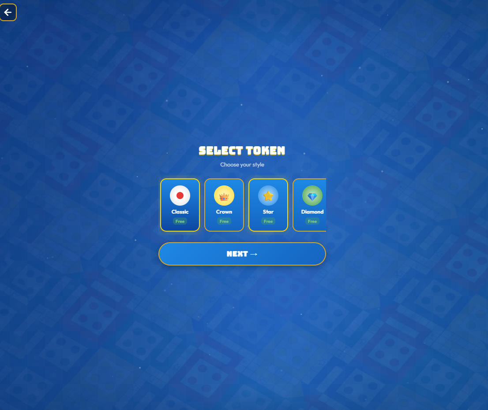

# 👑 Ludo Royale — Premium Board Game


**Ludo Royale** is a modern, high-performance web-based implementation of the classic Ludo board game. Designed with a premium aesthetic, smooth animations, and a responsive interface, it offers a top-tier gaming experience directly in your browser.

## ✨ Features

- **🏆 Premium UI/UX:** A sleek, modern design with a dark theme and gold accents.
- **🎮 Multiple Game Modes:**
  - **VS Computer:** Challenge our smart AI with adjustable difficulty levels.
  - **Pass N Play:** Play locally with friends on the same device.
- **🎨 Customization:** Choose from multiple premium token styles (Crown, Star, Diamond, and more).
- **🚀 High Performance:** Built with lightweight Vanilla JavaScript and Vite for lightning-fast loading and smooth 60FPS animations.
- **🎵 Immersive Audio:** High-quality sound effects and background music for an engaging experience.
- **✨ Particle Effects:** Dynamic background particles that make the game feel alive.

## 🛠️ Tech Stack

- **Frontend:** HTML5, Vanilla CSS3 (Custom Design System)
- **Logic:** Vanilla JavaScript (ES6+)
- **Build Tool:** [Vite](https://vitejs.dev/)
- **Assets:** Custom SVGs and Canvas-based rendering for the board.

## 🚀 Getting Started

To get a local copy up and running, follow these simple steps:

### Prerequisites

Make sure you have [Node.js](https://nodejs.org/) installed on your machine.

### Installation

1. **Clone the repository:**
   ```bash
   git clone https://github.com/sahaniTripurari/Ludo_WebGame.git
   ```

2. **Navigate to the project folder:**
   ```bash
   cd Ludo_WebGame
   ```

3. **Install dependencies:**
   ```bash
   npm install
   ```

4. **Start the development server:**
   ```bash
   npm start
   ```

5. **Build for production:**
   ```bash
   npm run build
   ```

## 📸 Screenshots

| Home Screen | Game Board | With Computer | Tokens 
| :---: | :---: | :---: | :---: |
|  |  |  | .

## 🤝 Contributing

Contributions are what make the open-source community such an amazing place to learn, inspire, and create. Any contributions you make are **greatly appreciated**.

1. Fork the Project
2. Create your Feature Branch (`git checkout -b feature/AmazingFeature`)
3. Commit your Changes (`git commit -m 'Add some AmazingFeature'`)
4. Push to the Branch (`git push origin feature/AmazingFeature`)
5. Open a Pull Request

## 📄 License

Distributed under the MIT License. See `LICENSE` for more information.

---

Developed with ❤️ by [Sahani Tripurari](https://github.com/sahaniTripurari)
